# Architecture Comparison: web-ui vs Your Implementation

## web-ui Architecture (Industrial Grade)

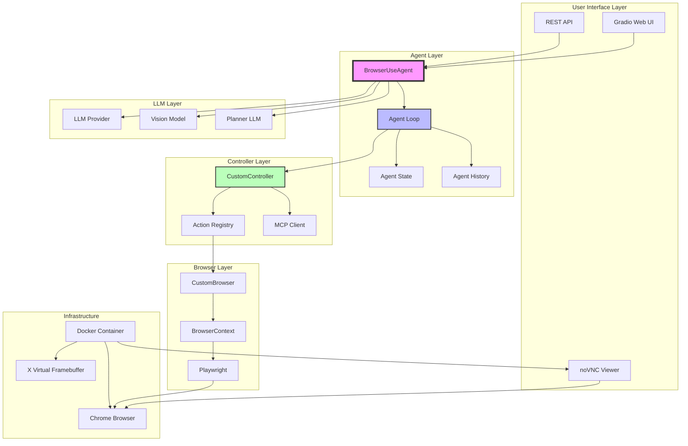

## Your Current Architecture (Proof of Concept)

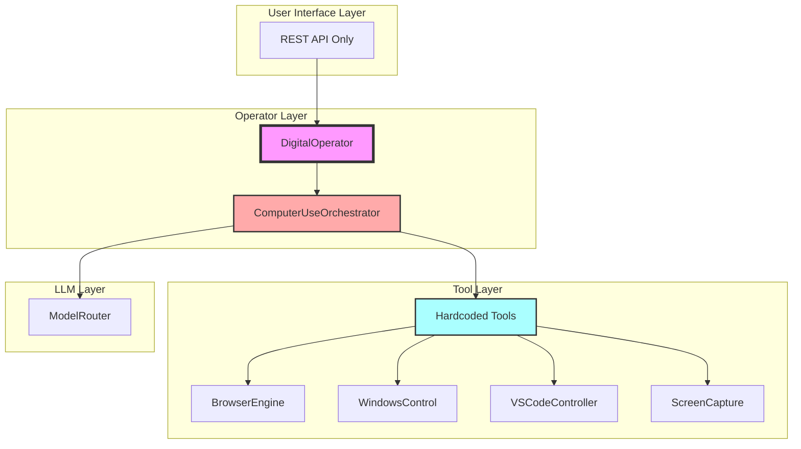

## Key Architectural Differences

### 1. Agent Loop vs Switch Statement

**web-ui (Correct):**
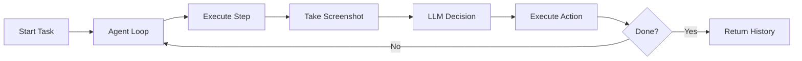

**Your Implementation (Broken):**
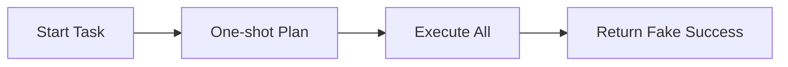

### 2. Vision Integration

**web-ui:**
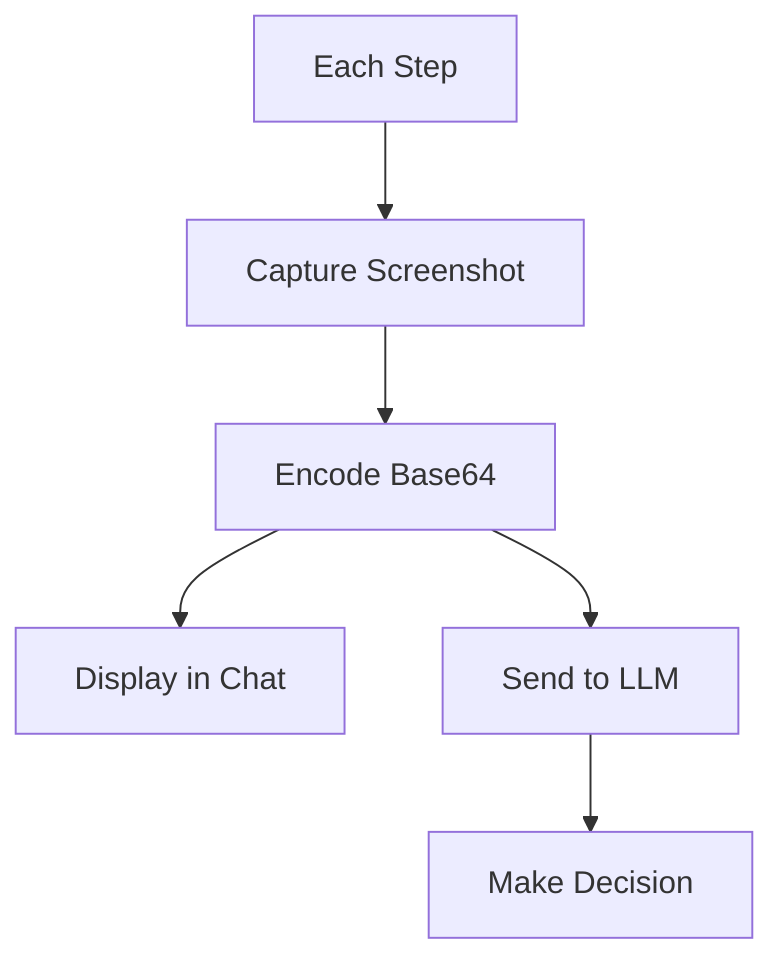

**Your Implementation:**
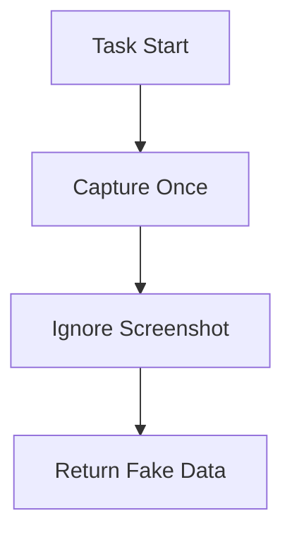

### 3. State Management

**web-ui:**
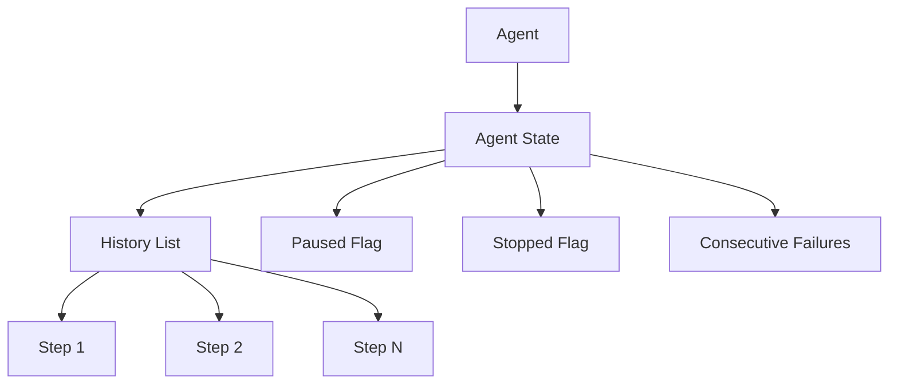

**Your Implementation:**
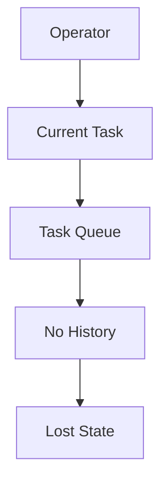

### 4. Error Handling

**web-ui:**
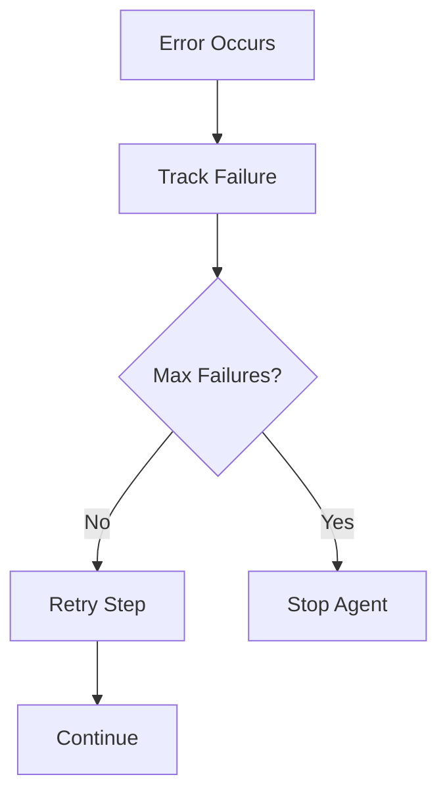

**Your Implementation:**
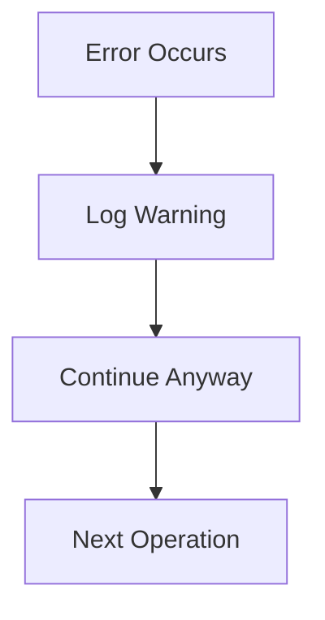

### 5. Human-in-the-Loop

**web-ui:**
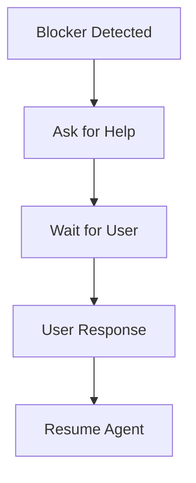

**Your Implementation:**
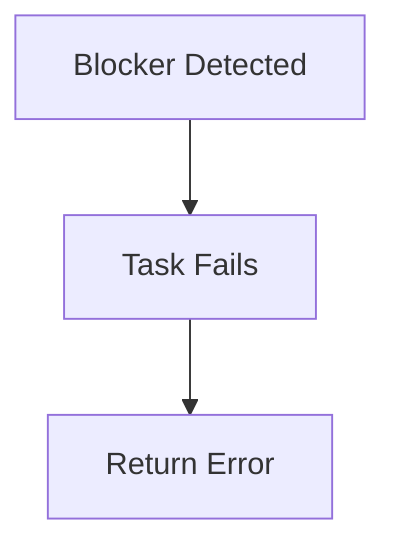

## Data Flow Comparison

### web-ui Data Flow
```
User Task
    ↓
Agent Loop (max_steps)
    ├─→ Capture Screenshot
    ├─→ Send to LLM (with vision)
    ├─→ LLM decides action
    ├─→ Execute action via Controller
    ├─→ Record in History
    ├─→ Check if done
    └─→ Repeat or finish
    ↓
Agent History (JSON + GIF)
```

### Your Data Flow
```
User Command
    ↓
One-shot LLM Planning
    ↓
Execute All Operations
    ↓
Return Fake Success
```

## Component Responsibilities

### web-ui Components

| Component | Responsibility |
|-----------|---------------|
| `BrowserUseAgent` | Agent loop, state management, step execution |
| `CustomController` | Action registry, MCP integration, tool execution |
| `CustomBrowser` | Browser lifecycle, anti-detection, context management |
| `BrowserContext` | Page state, element tracking, screenshot capture |
| `WebuiManager` | UI state, component management, chat history |
| `Gradio UI` | User interaction, settings, visualization |

### Your Components

| Component | Responsibility |
|-----------|---------------|
| `DigitalOperator` | Task queuing (no real execution) |
| `ComputerUseOrchestrator` | Switch statement (no real logic) |
| `BrowserEngine` | Basic Playwright wrapper |
| `WindowsControl` | Desktop automation (separate concern) |
| `VSCodeController` | VS Code automation (separate concern) |
| `ScreenCapture` | Screenshot capture (unused) |

## Missing Components in Your Implementation

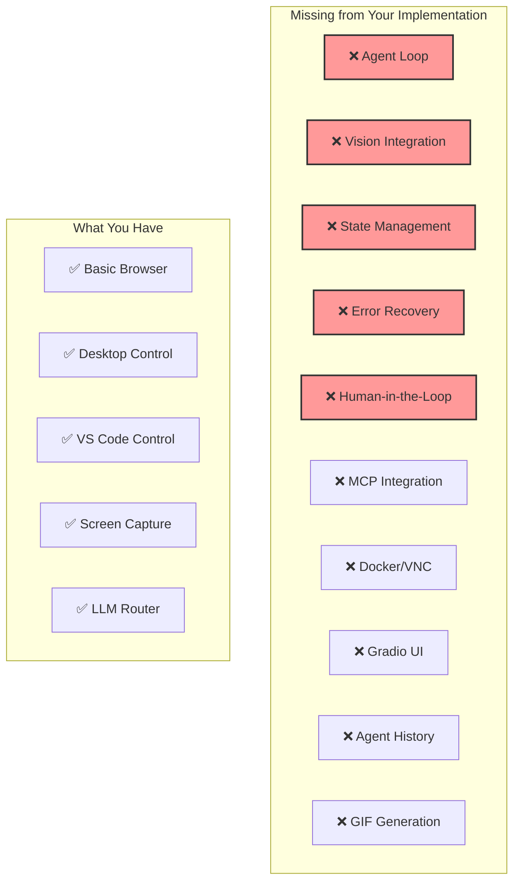

## Recommended Architecture (If Building from Scratch)

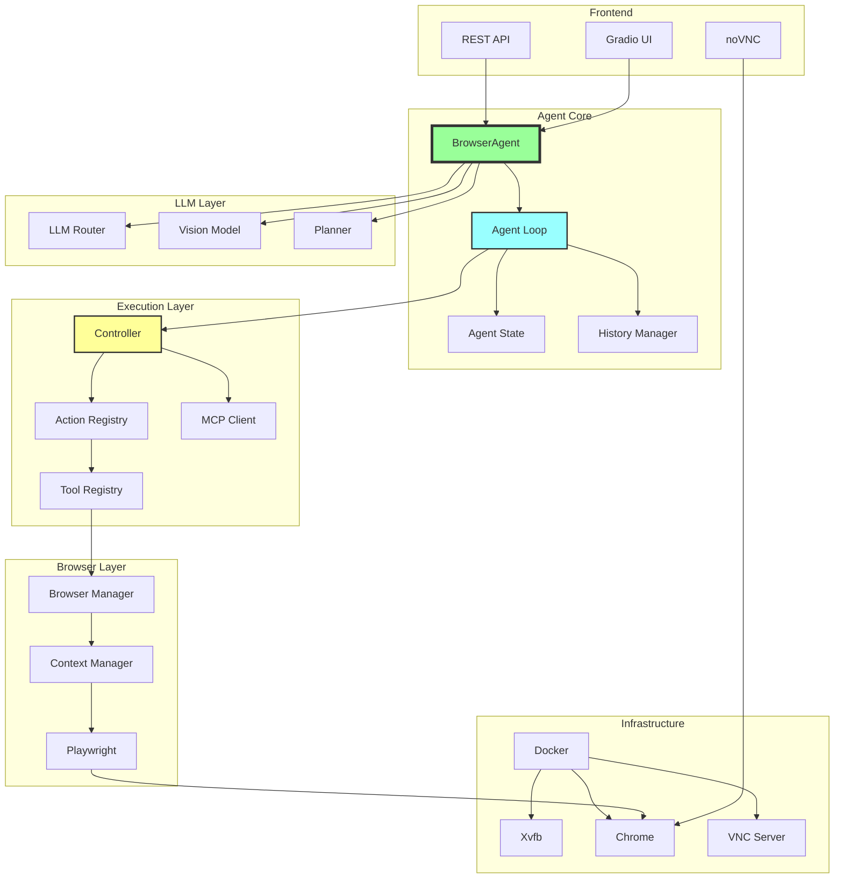

## Summary

Your current implementation is missing the **core agent loop** that makes browser automation actually work. You have the pieces (browser, LLM, screen capture) but they're not connected in a meaningful way.

The web-ui implementation shows that **the agent loop is the heart of the system**. Without it, you're just calling APIs and returning fake success responses.

**Bottom line**: You need to rebuild your `ComputerUseOrchestrator` to be a real agent loop, not a switch statement.
