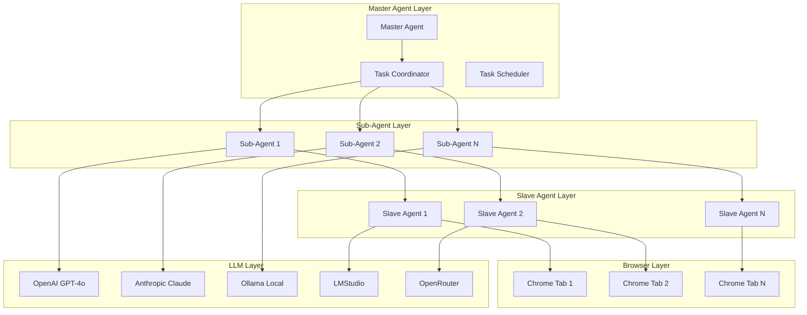

# Multi-Agent Orchestration Plan with browser-use

## Executive Summary

This plan extends the browser-use integration to support **multi-agent orchestration** with:
- Master/Sub-agent/Slave agent hierarchy
- Multiple Chrome tabs (parallel execution)
- Different LLM providers per agent (OpenRouter, Ollama, LMStudio, OpenAI)
- Task/goal/objective management
- Central coordination

## 🎯 Architecture Overview



## 📦 Implementation Plan

### Phase 1: Multi-Agent Core (Week 1)

#### 1.1 Agent Hierarchy Types
```typescript
// src/agents/types.ts
export interface AgentConfig {
  id: string;
  name: string;
  role: 'master' | 'sub' | 'slave';
  parentId?: string;
  llmProvider: 'openai' | 'anthropic' | 'ollama' | 'lmstudio' | 'openrouter';
  model: string;
  apiKey?: string;
  baseUrl?: string;
  capabilities: string[];
  maxConcurrentTasks: number;
  browserTabId?: string;
}

export interface Task {
  id: string;
  description: string;
  goal: string;
  objective: string;
  priority: 'low' | 'medium' | 'high' | 'critical';
  assignedTo?: string;
  status: 'pending' | 'in_progress' | 'completed' | 'failed';
  subtasks?: Task[];
  dependencies?: string[];
  result?: any;
  error?: string;
  createdAt: Date;
  startedAt?: Date;
  completedAt?: Date;
}

export interface AgentHierarchy {
  master: AgentConfig;
  subAgents: AgentConfig[];
  slaves: AgentConfig[];
}
```

#### 1.2 Multi-Agent Manager
```typescript
// src/agents/multiAgentManager.ts
import { Agent, BrowserSession, BrowserProfile } from 'browser-use';
import { ChatOpenAI } from 'browser-use/llm/openai';
import { ChatAnthropic } from 'browser-use/llm/anthropic';
import { v4 as uuidv4 } from 'uuid';

export class MultiAgentManager {
  private agents: Map<string, Agent> = new Map();
  private sessions: Map<string, BrowserSession> = new Map();
  private tasks: Map<string, Task> = new Map();
  private hierarchy: AgentHierarchy;

  constructor(hierarchy: AgentHierarchy) {
    this.hierarchy = hierarchy;
  }

  async initialize(): Promise<void> {
    // Initialize master agent
    await this.createAgent(this.hierarchy.master);

    // Initialize sub-agents
    for (const subConfig of this.hierarchy.subAgents) {
      await this.createAgent(subConfig);
    }

    // Initialize slave agents
    for (const slaveConfig of this.hierarchy.slaves) {
      await this.createAgent(slaveConfig);
    }
  }

  private async createAgent(config: AgentConfig): Promise<Agent> {
    // Create LLM based on provider
    const llm = this.createLLM(config);

    // Create browser profile with unique tab
    const profile = new BrowserProfile({
      headless: false,
      viewport: { width: 1920, height: 1080 },
      highlight_elements: true,
    });

    // Create browser session
    const session = new BrowserSession({ browser_profile: profile });
    this.sessions.set(config.id, session);

    // Create agent
    const agent = new Agent({
      task: '', // Will be set per task
      llm,
      browser_session: session,
      use_vision: true,
      max_actions_per_step: 5,
      max_failures: 3,
      validate_output: true,
    });

    this.agents.set(config.id, agent);
    return agent;
  }

  private createLLM(config: AgentConfig) {
    switch (config.llmProvider) {
      case 'openai':
        return new ChatOpenAI({
          model: config.model ?? 'gpt-4o',
          apiKey: config.apiKey ?? process.env.OPENAI_API_KEY,
        });
      case 'anthropic':
        return new ChatAnthropic({
          model: config.model ?? 'claude-sonnet-4-20250514',
          apiKey: config.apiKey ?? process.env.ANTHROPIC_API_KEY,
        });
      case 'ollama':
        return new ChatOpenAI({
          model: config.model ?? 'llama3',
          apiKey: 'ollama',
          baseUrl: config.baseUrl ?? process.env.OLLAMA_ENDPOINT ?? 'http://localhost:11434/v1',
        });
      case 'lmstudio':
        return new ChatOpenAI({
          model: config.model ?? 'local-model',
          apiKey: 'lmstudio',
          baseUrl: config.baseUrl ?? process.env.LMSTUDIO_ENDPOINT ?? 'http://localhost:1234/v1',
        });
      case 'openrouter':
        return new ChatOpenAI({
          model: config.model ?? 'openai/gpt-4o',
          apiKey: config.apiKey ?? process.env.OPENROUTER_API_KEY,
          baseUrl: 'https://openrouter.ai/api/v1',
        });
      default:
        throw new Error(`Unsupported LLM provider: ${config.llmProvider}`);
    }
  }

  async assignTask(task: Task, agentId: string): Promise<void> {
    const agent = this.agents.get(agentId);
    if (!agent) {
      throw new Error(`Agent not found: ${agentId}`);
    }

    task.assignedTo = agentId;
    task.status = 'in_progress';
    task.startedAt = new Date();
    this.tasks.set(task.id, task);

    // Update agent task
    agent.add_new_task(task.description);

    // Run agent
    const history = await agent.run();
    task.result = history.final_result();
    task.status = 'completed';
    task.completedAt = new Date();
  }

  async distributeTask(task: Task): Promise<void> {
    // Master distributes to sub-agents
    if (task.subtasks && task.subtasks.length > 0) {
      for (const subtask of task.subtasks) {
        const subAgentId = this.findAvailableAgent('sub');
        if (subAgentId) {
          await this.assignTask(subtask, subAgentId);
        }
      }
    } else {
      // Assign to slave agent
      const slaveAgentId = this.findAvailableAgent('slave');
      if (slaveAgentId) {
        await this.assignTask(task, slaveAgentId);
      }
    }
  }

  private findAvailableAgent(role: 'sub' | 'slave'): string | null {
    for (const [id, config] of this.hierarchy.subAgents.entries()) {
      if (config.role === role) {
        const agent = this.agents.get(id);
        if (agent && agent.state.status === 'idle') {
          return id;
        }
      }
    }
    return null;
  }

  async pauseAgent(agentId: string): Promise<void> {
    const agent = this.agents.get(agentId);
    if (agent) {
      agent.pause();
    }
  }

  async resumeAgent(agentId: string): Promise<void> {
    const agent = this.agents.get(agentId);
    if (agent) {
      agent.resume();
    }
  }

  async stopAgent(agentId: string): Promise<void> {
    const agent = this.agents.get(agentId);
    if (agent) {
      agent.stop();
    }
  }

  async cleanup(): Promise<void> {
    for (const session of this.sessions.values()) {
      await session.close();
    }
  }
}
```

### Phase 2: Parallel Tab Execution (Week 2)

#### 2.1 Tab Manager
```typescript
// src/browser/tabManager.ts
import { Browser, BrowserContext, Page } from 'playwright';

export class TabManager {
  private browser: Browser | null = null;
  private context: BrowserContext | null = null;
  private tabs: Map<string, Page> = new Map();

  async initialize(): Promise<void> {
    const { chromium } = await import('playwright');
    this.browser = await chromium.launch({ headless: false });
    this.context = await this.browser.newContext();
  }

  async createTab(tabId: string): Promise<Page> {
    if (!this.context) {
      throw new Error('Browser not initialized');
    }

    const page = await this.context.newPage();
    this.tabs.set(tabId, page);
    return page;
  }

  async getTab(tabId: string): Promise<Page | undefined> {
    return this.tabs.get(tabId);
  }

  async closeTab(tabId: string): Promise<void> {
    const page = this.tabs.get(tabId);
    if (page) {
      await page.close();
      this.tabs.delete(tabId);
    }
  }

  async closeAll(): Promise<void> {
    for (const [tabId, page] of this.tabs.entries()) {
      await page.close();
    }
    this.tabs.clear();
  }

  getTabCount(): number {
    return this.tabs.size;
  }
}
```

### Phase 3: Task Orchestration (Week 3)

#### 3.1 Task Coordinator
```typescript
// src/agents/taskCoordinator.ts
import { Task, AgentConfig } from './types';
import { MultiAgentManager } from './multiAgentManager';

export class TaskCoordinator {
  private manager: MultiAgentManager;
  private taskQueue: Task[] = [];
  private activeTasks: Map<string, Task> = new Map();

  constructor(manager: MultiAgentManager) {
    this.manager = manager;
  }

  async submitTask(task: Task): Promise<void> {
    this.taskQueue.push(task);
    await this.processQueue();
  }

  private async processQueue(): Promise<void> {
    while (this.taskQueue.length > 0) {
      const task = this.taskQueue.shift()!;
      await this.manager.distributeTask(task);
      this.activeTasks.set(task.id, task);
    }
  }

  async getTaskStatus(taskId: string): Promise<Task | undefined> {
    return this.activeTasks.get(taskId);
  }

  async cancelTask(taskId: string): Promise<void> {
    const task = this.activeTasks.get(taskId);
    if (task && task.assignedTo) {
      await this.manager.stopAgent(task.assignedTo);
      task.status = 'failed';
      task.error = 'Cancelled by user';
    }
  }

  getActiveTasks(): Task[] {
    return Array.from(this.activeTasks.values());
  }

  getQueuedTasks(): Task[] {
    return [...this.taskQueue];
  }
}
```

### Phase 4: API Integration (Week 4)

#### 4.1 Multi-Agent API Endpoints
```typescript
// src/api/routes/multiAgent.ts
import { Router, Request, Response } from 'express';
import { MultiAgentManager } from '../../agents/multiAgentManager';
import { TaskCoordinator } from '../../agents/taskCoordinator';
import { AgentHierarchy, Task } from '../../agents/types';

const router = Router();
let manager: MultiAgentManager | null = null;
let coordinator: TaskCoordinator | null = null;

// Initialize multi-agent system
router.post('/initialize', async (req: Request, res: Response) => {
  try {
    const { hierarchy } = req.body;
    manager = new MultiAgentManager(hierarchy);
    await manager.initialize();
    coordinator = new TaskCoordinator(manager);
    res.json({ success: true });
  } catch (error) {
    res.status(500).json({ success: false, error: error.message });
  }
});

// Submit task
router.post('/tasks', async (req: Request, res: Response) => {
  try {
    const { task } = req.body;
    await coordinator!.submitTask(task);
    res.json({ success: true, taskId: task.id });
  } catch (error) {
    res.status(500).json({ success: false, error: error.message });
  }
});

// Get task status
router.get('/tasks/:taskId', async (req: Request, res: Response) => {
  try {
    const task = await coordinator!.getTaskStatus(req.params.taskId);
    if (!task) {
      return res.status(404).json({ success: false, error: 'Task not found' });
    }
    res.json({ success: true, task });
  } catch (error) {
    res.status(500).json({ success: false, error: error.message });
  }
});

// Cancel task
router.post('/tasks/:taskId/cancel', async (req: Request, res: Response) => {
  try {
    await coordinator!.cancelTask(req.params.taskId);
    res.json({ success: true });
  } catch (error) {
    res.status(500).json({ success: false, error: error.message });
  }
});

// Get all tasks
router.get('/tasks', async (req: Request, res: Response) => {
  try {
    const active = coordinator!.getActiveTasks();
    const queued = coordinator!.getQueuedTasks();
    res.json({ success: true, active, queued });
  } catch (error) {
    res.status(500).json({ success: false, error: error.message });
  }
});

// Pause agent
router.post('/agents/:agentId/pause', async (req: Request, res: Response) => {
  try {
    await manager!.pauseAgent(req.params.agentId);
    res.json({ success: true });
  } catch (error) {
    res.status(500).json({ success: false, error: error.message });
  }
});

// Resume agent
router.post('/agents/:agentId/resume', async (req: Request, res: Response) => {
  try {
    await manager!.resumeAgent(req.params.agentId);
    res.json({ success: true });
  } catch (error) {
    res.status(500).json({ success: false, error: error.message });
  }
});

// Stop agent
router.post('/agents/:agentId/stop', async (req: Request, res: Response) => {
  try {
    await manager!.stopAgent(req.params.agentId);
    res.json({ success: true });
  } catch (error) {
    res.status(500).json({ success: false, error: error.message });
  }
});

export default router;
```

---

## 📊 LLM Provider Configuration

### OpenAI
```typescript
{
  llmProvider: 'openai',
  model: 'gpt-4o',
  apiKey: process.env.OPENAI_API_KEY
}
```

### Anthropic
```typescript
{
  llmProvider: 'anthropic',
  model: 'claude-sonnet-4-20250514',
  apiKey: process.env.ANTHROPIC_API_KEY
}
```

### Ollama (Local)
```typescript
{
  llmProvider: 'ollama',
  model: 'llama3',
  baseUrl: 'http://localhost:11434/v1'
}
```

### LMStudio (Local)
```typescript
{
  llmProvider: 'lmstudio',
  model: 'local-model',
  baseUrl: 'http://localhost:1234/v1'
}
```

### OpenRouter
```typescript
{
  llmProvider: 'openrouter',
  model: 'openai/gpt-4o',
  apiKey: process.env.OPENROUTER_API_KEY,
  baseUrl: 'https://openrouter.ai/api/v1'
}
```

---

## 🎯 Example Usage

### Create Multi-Agent Hierarchy
```typescript
const hierarchy: AgentHierarchy = {
  master: {
    id: 'master-1',
    name: 'Master Coordinator',
    role: 'master',
    llmProvider: 'openai',
    model: 'gpt-4o',
    capabilities: ['coordination', 'planning'],
    maxConcurrentTasks: 10,
  },
  subAgents: [
    {
      id: 'sub-1',
      name: 'Research Agent',
      role: 'sub',
      parentId: 'master-1',
      llmProvider: 'anthropic',
      model: 'claude-sonnet-4-20250514',
      capabilities: ['research', 'analysis'],
      maxConcurrentTasks: 3,
    },
    {
      id: 'sub-2',
      name: 'Development Agent',
      role: 'sub',
      parentId: 'master-1',
      llmProvider: 'ollama',
      model: 'codellama',
      capabilities: ['coding', 'testing'],
      maxConcurrentTasks: 2,
    },
  ],
  slaves: [
    {
      id: 'slave-1',
      name: 'Browser Agent 1',
      role: 'slave',
      parentId: 'sub-1',
      llmProvider: 'lmstudio',
      model: 'local-model',
      capabilities: ['web_navigation', 'data_extraction'],
      maxConcurrentTasks: 1,
      browserTabId: 'tab-1',
    },
    {
      id: 'slave-2',
      name: 'Browser Agent 2',
      role: 'slave',
      parentId: 'sub-1',
      llmProvider: 'openrouter',
      model: 'meta-llama/llama-3-70b-instruct',
      capabilities: ['web_navigation', 'form_filling'],
      maxConcurrentTasks: 1,
      browserTabId: 'tab-2',
    },
  ],
};

const manager = new MultiAgentManager(hierarchy);
await manager.initialize();
```

### Submit Task
```typescript
const task: Task = {
  id: uuidv4(),
  description: 'Research TypeScript frameworks',
  goal: 'Find best TypeScript frameworks for AI agents',
  objective: 'Compare features, performance, and community support',
  priority: 'high',
  status: 'pending',
  subtasks: [
    {
      id: uuidv4(),
      description: 'Search for TypeScript agent frameworks',
      goal: 'Find popular frameworks',
      objective: 'Identify top 5 frameworks',
      priority: 'high',
      status: 'pending',
    },
    {
      id: uuidv4(),
      description: 'Compare framework features',
      goal: 'Analyze capabilities',
      objective: 'Create comparison matrix',
      priority: 'medium',
      status: 'pending',
    },
  ],
  createdAt: new Date(),
};

const coordinator = new TaskCoordinator(manager);
await coordinator.submitTask(task);
```

---

## 📁 File Structure

```
src/
├── agents/
│   ├── types.ts                 # Agent and Task types
│   ├── browserAgent.ts          # Single agent service
│   ├── agentManager.ts          # Single agent manager
│   ├── multiAgentManager.ts     # Multi-agent orchestration
│   ├── taskCoordinator.ts       # Task distribution
│   └── index.ts                 # Exports
├── browser/
│   ├── engine.ts                # Existing browser engine
│   ├── tabManager.ts            # Multi-tab management
│   └── index.ts                 # Exports
├── api/
│   └── routes/
│       ├── browserAgent.ts      # Single agent API
│       ├── multiAgent.ts        # Multi-agent API
│       └── index.ts             # Route exports
frontend/
└── dashboard/
    └── src/
        └── components/
            ├── BrowserAgent.tsx      # Single agent UI
            ├── MultiAgentDashboard.tsx # Multi-agent UI
            └── index.ts              # Component exports
```

---

## ✅ Implementation Checklist

### Week 1: Multi-Agent Core
- [ ] Define agent hierarchy types
- [ ] Create MultiAgentManager
- [ ] Implement LLM provider factory
- [ ] Test with different providers

### Week 2: Parallel Execution
- [ ] Create TabManager
- [ ] Implement parallel tab execution
- [ ] Test with multiple agents
- [ ] Handle tab conflicts

### Week 3: Task Orchestration
- [ ] Create TaskCoordinator
- [ ] Implement task distribution
- [ ] Add task status tracking
- [ ] Test complex workflows

### Week 4: API & UI
- [ ] Create multi-agent API endpoints
- [ ] Build React dashboard
- [ ] Add real-time monitoring
- [ ] Write documentation

---

## 🚀 Quick Start

```bash
# 1. Install dependencies
npm install browser-use @playwright/test uuid

# 2. Install Playwright browsers
npx playwright install chromium

# 3. Set environment variables
export OPENAI_API_KEY=your_key_here
export ANTHROPIC_API_KEY=your_key_here
export OPENROUTER_API_KEY=your_key_here

# 4. Start Ollama (for local models)
ollama serve

# 5. Start LMStudio (for local models)
# Open LMStudio and load a model

# 6. Run the application
npm run dev
```

---

## 💡 Key Features

1. **Master/Sub/Slave Hierarchy** - Clear agent roles and responsibilities
2. **Parallel Tab Execution** - Multiple agents working simultaneously
3. **Multi-LLM Support** - Different models for different agents
4. **Task Orchestration** - Automatic task distribution
5. **Real-time Monitoring** - Track agent status and progress
6. **Error Recovery** - Automatic retry and failure handling
7. **Human-in-the-Loop** - Agents can ask for help when stuck
8. **State Management** - Full history and resume capability
