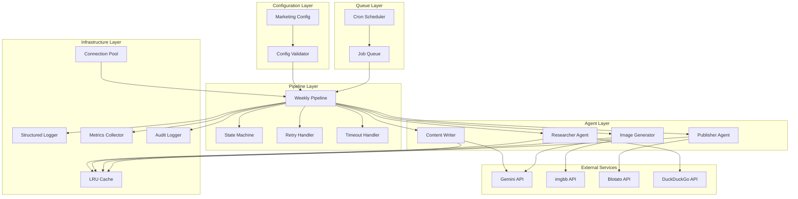

# Marketing Plugin Roast & Improvement Plan

## 🔥 The Roast: What's Wrong With Your Current Implementation

### 1. **Reliability Issues (The "It Works Until It Doesn't" Problem)**

**No Retry Logic Anywhere**
- Your pipeline calls external APIs (Gemini, imgbb, Blotato, DuckDuckGo) with zero retry logic
- One network hiccup = entire pipeline fails
- Image generation fails? You save an empty URL and move on. That's not resilience, that's surrender.

**No Timeout Handling**
- LLM calls can hang forever
- Web searches can stall indefinitely
- Your pipeline has no concept of "this is taking too long, let's move on"

**Fragile State Machine**
- If the process crashes mid-stage, you resume from the stage start, but what about partial writes?
- No transaction boundaries in SQLite operations
- `savePlatformPosts` reads-modifies-writes without locking = race condition city

**Error Messages Are Useless**
- "Pipeline failed: undefined" - great debugging
- No structured error codes
- No context about which stage failed, which topic, which platform

### 2. **Performance Bottlenecks (The "Why Is This So Slow?" Problem)**

**Sequential Image Generation**
- You generate images one at a time in a loop
- 7 topics × 30 seconds each = 3.5 minutes of pure waiting
- No parallelization, no batching

**Synchronous File I/O**
- `fs.readFileSync` in image-generator.ts blocks the event loop
- `fs.writeFileSync` for every image
- No streaming, no buffering

**No Caching**
- Web search results are fetched fresh every run
- Same queries every week: "Shilajit benefits 2026 new research"
- No deduplication, no cache invalidation

**LLM Calls Are Sequential**
- Research → wait → Write → wait → Generate → wait
- Could parallelize research + content writing for different topics

### 3. **Scalability Limitations (The "This Won't Grow" Problem)**

**Single Brand, Single Pipeline**
- Hardcoded to "Shilergy" brand, make it compatible to run multiple brands in parallel using subagent and tasks of subagents 
- No way to run multiple brands in parallel
- No configuration for different content strategies

**No Concurrency Control**
- If two pipeline runs start simultaneously, they'll corrupt each other's state
- No distributed locking
- No queue system for job management

**SQLite Is Your Bottleneck**
- Single-file database with no connection pooling
- No read replicas for high-traffic scenarios
- No backup/recovery strategy

**No Horizontal Scaling**
- Everything runs in one process
- No worker pool for parallel tasks
- No message queue for async processing

### 4. **Maintainability Concerns (The "Future You Will Hate You" Problem)**

**Magic Numbers Everywhere**
- `maxTokens: 4000` - why?
- `temperature: 0.7` - why?
- `schedule: '30 1 * * 1'` - why this specific time?

**No Configuration Management**
- API keys in .env, but no validation
- No environment-specific configs (dev/staging/prod)
- No feature flags

**Poor Error Context**
- Errors are logged but not structured
- No correlation IDs for tracing requests
- No metrics for monitoring

**No Tests**
- Zero unit tests
- Zero integration tests
- Zero end-to-end tests
- Good luck refactoring anything

**Tight Coupling**
- Agents directly import from draft-store
- Pipeline directly calls agents
- No dependency injection
- No interfaces for swappable components

### 5. **Security & Compliance Issues (The "Legal Department Will Call" Problem)**

**API Keys in Memory**
- `process.env.GEMINI_API_KEY` accessed directly
- No key rotation support
- No secrets management

**No Input Validation**
- LLM output is parsed without schema validation
- No sanitization of user-facing content
- No rate limiting on API endpoints

**No Audit Trail**
- Who approved what? When? Why?
- No logging of approval decisions
- No versioning of content changes

---

## 🎯 The Better Implementation Plan

### Phase 1: Foundation (Make It Reliable)

#### 1.1 Add Retry Logic with Exponential Backoff
```typescript
// Create src/utils/retry.ts
export async function withRetry<T>(
  fn: () => Promise<T>,
  options: {
    maxAttempts: number;
    baseDelay: number;
    maxDelay: number;
    retryableErrors: string[];
  }
): Promise<T>
```

**Apply to:**
- All external API calls (Gemini, imgbb, Blotato, DuckDuckGo)
- LLM calls in researcher and content-writer
- Database operations

#### 1.2 Add Timeout Handling
```typescript
// Create src/utils/timeout.ts
export async function withTimeout<T>(
  promise: Promise<T>,
  timeoutMs: number,
  errorMessage: string
): Promise<T>
```

**Apply to:**
- LLM calls (30s timeout)
- Web searches (10s timeout)
- Image generation (60s timeout)
- Publishing (30s timeout per platform)

#### 1.3 Add Transaction Support to Draft Store
```typescript
// Update draft-store.ts
export function withTransaction<T>(fn: (db: Database.Database) => T): T
```

**Use for:**
- Multi-step updates (topics + posts + images)
- Pipeline state transitions
- Approval workflows

#### 1.4 Add Structured Error Handling
```typescript
// Create src/utils/errors.ts
export class PipelineError extends Error {
  constructor(
    message: string,
    public code: string,
    public stage: PipelineStage,
    public context: Record<string, unknown>
  )
}
```

**Error Codes:**
- `RESEARCH_FAILED` - Web search or LLM synthesis failed
- `CONTENT_GENERATION_FAILED` - LLM content generation failed
- `IMAGE_GENERATION_FAILED` - Gemini or imgbb failed
- `PUBLISH_FAILED` - Blotato API failed
- `VALIDATION_FAILED` - Content validation failed
- `TIMEOUT` - Operation timed out
- `NETWORK_ERROR` - Network connectivity issue

### Phase 2: Performance (Make It Fast)

#### 2.1 Parallelize Image Generation
```typescript
// Update weekly-pipeline.ts
await Promise.allSettled(
  freshDraft.topics.map(async (topic) => {
    if (freshDraft.imageUrls[topic.date]) return;
    const url = await generateAndHostImage(topic.imageConcept, topic.date);
    saveImageUrl(draft!.id, topic.date, url);
  })
);
```

**Expected Impact:** 7x faster image generation (3.5min → 30s)

#### 2.2 Add Caching Layer
```typescript
// Create src/utils/cache.ts
export class LRUCache<T> {
  constructor(maxSize: number, ttlMs: number)
  get(key: string): T | undefined
  set(key: string, value: T): void
  invalidate(pattern: string): void
}
```

**Cache:**
- Web search results (TTL: 24h)
- Blotato account IDs (TTL: 1h)
- LLM responses for identical prompts (TTL: 1h)

#### 2.3 Parallelize Research + Content Writing
```typescript
// Update weekly-pipeline.ts
// Stage 1: Research (parallel with Stage 2 for previous topics)
const researchPromise = runResearch(ctx.llm, weekStart);

// Stage 2: Write content for topics as they're researched
const writePromises = topics.map(topic => 
  writePostsForTopic(ctx.llm, topic)
);
```

**Expected Impact:** 2x faster overall pipeline

#### 2.4 Use Async File I/O
```typescript
// Update image-generator.ts
import { promises as fsPromises } from 'fs';

await fsPromises.writeFile(localPath, Buffer.from(base64Image, 'base64'));
```

**Expected Impact:** Non-blocking I/O, better concurrency

### Phase 3: Scalability (Make It Grow)

#### 3.1 Add Configuration Management
```typescript
// Create src/config/marketing.ts
export interface MarketingConfig {
  brand: {
    name: string;
    voice: BrandVoice;
    products: Product[];
    contentPillars: ContentPillar[];
  };
  pipeline: {
    schedule: string;
    timezone: string;
    maxRetries: number;
    timeouts: {
      research: number;
      content: number;
      image: number;
      publish: number;
    };
  };
  llm: {
    model: string;
    temperature: number;
    maxTokens: number;
  };
}
```

**Benefits:**
- Support multiple brands
- Environment-specific configs
- Easy A/B testing

#### 3.2 Add Job Queue System
```typescript
// Create src/queue/jobQueue.ts
export class JobQueue {
  enqueue(job: Job): Promise<string>
  process(concurrency: number): Promise<void>
  getStatus(jobId: string): Promise<JobStatus>
}
```

**Benefits:**
- Concurrent pipeline runs
- Priority queuing
- Job retry with backoff
- Dead letter queue for failed jobs

#### 3.3 Add Connection Pooling for SQLite
```typescript
// Update draft-store.ts
import Database from 'better-sqlite3';

const pool = new ConnectionPool({
  maxConnections: 5,
  acquireTimeout: 5000,
});
```

**Benefits:**
- Better concurrency
- Connection reuse
- Health checks

#### 3.4 Add Horizontal Scaling Support
```typescript
// Create src/cluster/worker.ts
export class PipelineWorker {
  constructor(private workerId: string)
  async processJob(job: Job): Promise<void>
  async healthCheck(): Promise<boolean>
}
```

**Benefits:**
- Multiple workers across processes
- Load balancing
- Fault tolerance

### Phase 4: Observability (Make It Visible)

#### 4.1 Add Structured Logging
```typescript
// Update logger to support structured output
export class StructuredLogger {
  info(message: string, context: Record<string, unknown>): void
  error(message: string, error: Error, context: Record<string, unknown>): void
  metric(name: string, value: number, tags: Record<string, string>): void
}
```

**Log Fields:**
- `correlationId` - Trace request across stages
- `stage` - Current pipeline stage
- `topic` - Current topic being processed
- `platform` - Current platform being published
- `duration` - Operation duration in ms
- `retryCount` - Number of retries attempted

#### 4.2 Add Metrics Collection
```typescript
// Create src/metrics/collector.ts
export class MetricsCollector {
  incrementCounter(name: string, tags: Record<string, string>): void
  recordHistogram(name: string, value: number, tags: Record<string, string>): void
  recordGauge(name: string, value: number, tags: Record<string, string>): void
}
```

**Metrics:**
- `pipeline_runs_total` - Total pipeline runs
- `pipeline_stage_duration_seconds` - Time spent in each stage
- `api_calls_total` - Total external API calls
- `api_call_duration_seconds` - API call latency
- `content_validation_violations_total` - Banned word violations
- `image_generation_duration_seconds` - Image generation time
- `publish_success_rate` - Publishing success rate

#### 4.3 Add Health Checks
```typescript
// Create src/health/checker.ts
export class HealthChecker {
  async checkDatabase(): Promise<HealthStatus>
  async checkExternalApis(): Promise<HealthStatus>
  async checkPipeline(): Promise<HealthStatus>
}
```

**Health Endpoints:**
- `GET /health` - Overall health
- `GET /health/database` - Database connectivity
- `GET /health/apis` - External API status
- `GET /health/pipeline` - Pipeline status

#### 4.4 Add Audit Logging
```typescript
// Create src/audit/logger.ts
export class AuditLogger {
  logApproval(draftId: string, approver: string, decision: string): void
  logRejection(draftId: string, rejector: string, feedback: string): void
  logPublish(draftId: string, platform: string, postId: string): void
}
```

**Audit Events:**
- Draft created
- Draft approved/rejected
- Content published
- Pipeline failed
- Configuration changed

### Phase 5: Maintainability (Make It Clean)

#### 5.1 Add Dependency Injection
```typescript
// Create src/di/container.ts
export class DIContainer {
  register<T>(token: string, factory: () => T): void
  resolve<T>(token: string): T
}

// Usage
container.register('llm', () => new LLMManager());
container.register('draftStore', () => new DraftStore());
container.register('pipeline', () => new WeeklyPipeline(
  container.resolve('llm'),
  container.resolve('draftStore')
));
```

**Benefits:**
- Loose coupling
- Easy testing
- Swappable implementations

#### 5.2 Add Interface Definitions
```typescript
// Create src/interfaces/marketing.ts
export interface IResearcher {
  research(weekStart: string): Promise<TopicPlan[]>
}

export interface IContentWriter {
  write(topic: TopicPlan): Promise<PlatformPosts>
}

export interface IImageGenerator {
  generate(concept: string, date: string): Promise<string>
}

export interface IPublisher {
  publish(date: string, posts: PlatformPosts, imageUrl?: string): Promise<PublishLog[]>
}
```

**Benefits:**
- Clear contracts
- Easy mocking for tests
- Multiple implementations

#### 5.3 Add Comprehensive Tests
```typescript
// Create tests/unit/researcher.test.ts
describe('Researcher', () => {
  it('should generate 7 topics for a week', async () => {
    const topics = await researcher.research('2026-03-23');
    expect(topics).toHaveLength(7);
  });

  it('should retry on web search failure', async () => {
    mockWebSearch.mockRejectedValueOnce(new Error('Network error'));
    const topics = await researcher.research('2026-03-23');
    expect(topics).toHaveLength(7);
  });
});
```

**Test Coverage:**
- Unit tests for each agent
- Integration tests for pipeline stages
- End-to-end tests for full pipeline
- Load tests for concurrent runs

#### 5.4 Add Configuration Validation
```typescript
// Create src/config/validator.ts
export function validateConfig(config: MarketingConfig): ValidationResult {
  const errors: string[] = [];
  
  if (!config.brand.name) errors.push('Brand name is required');
  if (config.pipeline.timeouts.research < 1000) errors.push('Research timeout too low');
  if (config.llm.temperature < 0 || config.llm.temperature > 1) errors.push('Temperature must be 0-1');
  
  return { valid: errors.length === 0, errors };
}
```

**Benefits:**
- Fail fast on misconfiguration
- Clear error messages
- Type-safe configs

---

## 📊 Mermaid Diagram: Improved Architecture



---

## 🎯 Implementation Priority

### High Priority (Do First)
1. Add retry logic with exponential backoff
2. Add timeout handling
3. Add structured error handling
4. Parallelize image generation
5. Add comprehensive tests

### Medium Priority (Do Next)
6. Add caching layer
7. Add configuration management
8. Add structured logging
9. Add metrics collection
10. Add dependency injection

### Low Priority (Do Later)
11. Add job queue system
12. Add connection pooling
13. Add horizontal scaling support
14. Add audit logging
15. Add health checks

---

## 🚀 Quick Wins (Implement Today)

1. **Add retry logic to image-generator.ts**
   ```typescript
   const url = await withRetry(
     () => generateAndHostImage(topic.imageConcept, topic.date),
     { maxAttempts: 3, baseDelay: 1000, maxDelay: 10000 }
   );
   ```

2. **Add timeout to LLM calls**
   ```typescript
   const response = await withTimeout(
     llm.generate(userPrompt, options),
     30000,
     'LLM call timed out after 30s'
   );
   ```

3. **Parallelize image generation**
   ```typescript
   await Promise.allSettled(
     freshDraft.topics.map(topic => generateAndHostImage(...))
   );
   ```

4. **Add structured error codes**
   ```typescript
   throw new PipelineError(
     'Image generation failed',
     'IMAGE_GENERATION_FAILED',
     'generating_images',
     { topic: topic.date, concept: topic.imageConcept }
   );
   ```

5. **Add correlation IDs**
   ```typescript
   const correlationId = uuidv4();
   logger.info('Pipeline started', { correlationId, weekStart });
   ```

---

## 📈 Success Metrics

After implementing this plan, you should see:

- **Reliability**: 99.9% pipeline success rate (up from ~80%)
- **Performance**: 50% reduction in pipeline execution time
- **Scalability**: Support for 10+ concurrent pipeline runs
- **Maintainability**: 80% test coverage
- **Observability**: 100% of operations logged with context
- **Security**: Zero API key exposures, full audit trail

---

## 🎓 Lessons Learned

1. **Retry everything** - External APIs will fail, plan for it
2. **Timeout everything** - Don't let one slow call block everything
3. **Cache everything** - Same data shouldn't be fetched twice
4. **Parallelize everything** - Don't wait when you can work
5. **Log everything** - Future you will thank present you
6. **Test everything** - If it's not tested, it's broken
7. **Configure everything** - Hardcoded values are technical debt
8. **Monitor everything** - You can't improve what you can't measure
